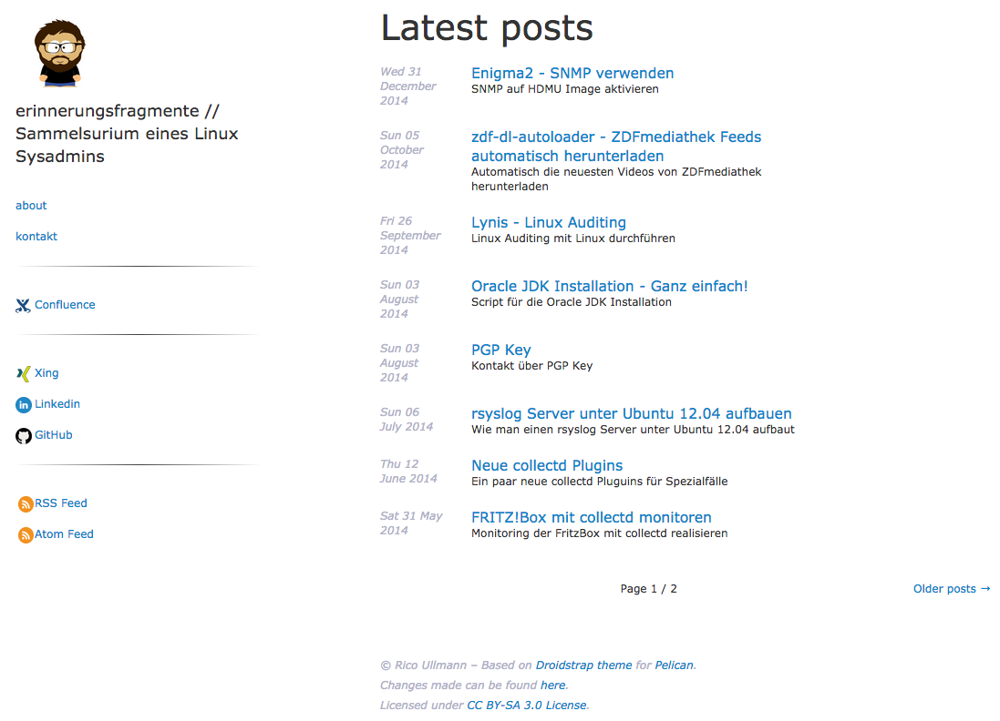

# Droidstrap

A Pelican theme using Bootstrap 2 and standard fonts.
Forked from [jamescooke/droidstrap](https://github.com/jamescooke/droidstrap).
James used Droid Fonts. This fork doesn't.

Original running on [jamescooke.info](http://jamescooke.info)  
Fork running on [erinnerungsfragmente.de](https://erinnerungsfragmente.de)

## Credits

I'd like to thank James for his hard work on this theme and for providing it under the CC BY-SA 3.0 license. It allows me to bring in my requirements, share it and be perfectly happy with it.

## Features

Theme is still in a very basic state. It has:

* Basic content listing - home, tag, category.
* Single post and single page templates.
* A touch of responsiveness.
* Tag pages.
* Category pages.
* Code highlighting with monokai.
* Social links
* Menu items (`MENUITEMS`)

And some bugs!  
(Couldn't find any so far, but you know it works.)

## Missing things

* Handling of Pelican links setting.
* Clean and valid HTML - partly as a result of some external libraries.

It's all open - contributions welcome, especially with HTML / CSS. Please check
out the Issues.

## Missing things (rullmann)

* Static comments
* flying pinguins (nyan cat style)

## Settings

We've stuck a few settings in to customise the theme.

### General

* `PROFILE_IMG_URL` - Set the image for the top circle cutout. (Has no default yet).
* `SOCIAL` - Add social links to your Menu
* `MENUITEMS` - More items for the menu required? Just add them!
* `DISPLAY_FEEDS` - If set to True feeds will be listed within the menu.

#### Social & Menu items

Social links do have icons. Just define `SOCIAL`in your `pelicanconf.py`:

<code>SOCIAL = (('GitHub', 'https://github.com/rullmann'),)</code>

In `droidsans.css` you can change the Social section to your needs. Maybe add some icons and send a pull request?

The same is possible for Menu items.

#### Feeds

Feeds can be menu items or just within the meta section. It's up to you.  
For the metadata section `FEED_ALL_RSS` and/or `FEED_ALL_ATOM` options must exist.  
`DISPLAY_FEEDS` must be set in order to display the feeds as menu items.

## License & Contributors

Licensed under [GNU Affero GPL 3](http://www.gnu.org/licenses/agpl.txt) - the same license as [Pelican](https://github.com/getpelican/pelican) itself.

[Contributors are listed](CONTRIBUTORS.md). Thanks all!
